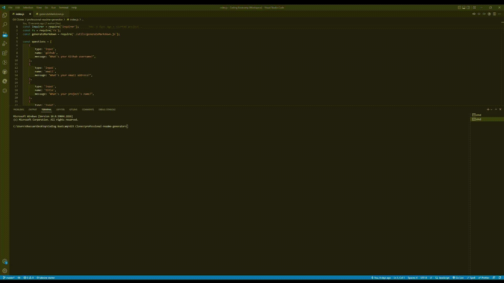

# Professional README Generator

## Description
This project runs in the command line and asks the user a series of questions. When those questions are answered, they will be saved to be used in the generated README file.

## Installation
To install this application, simply download the repository using your desired method:
1. Run 'git clone' with the SSH link in your command line.
2. Download the zip file by clicking on the green 'code' button then clicking 'download zip'.

## Usage
To use this application, open your preferred command line application, navigate to where folder in which 'index.js' is located and run the command 'node index.js'. Following that, simply answer the questions prompted by the application and your README file will be generated upon answering the final question.

## Demo
The demo can be viewed in GIF form below:

Alternetivaly, the video can be viewed by clicking this <a href='https://watch.screencastify.com/v/bB77OddPcbV1PQT4hvUT'>link</a>.
